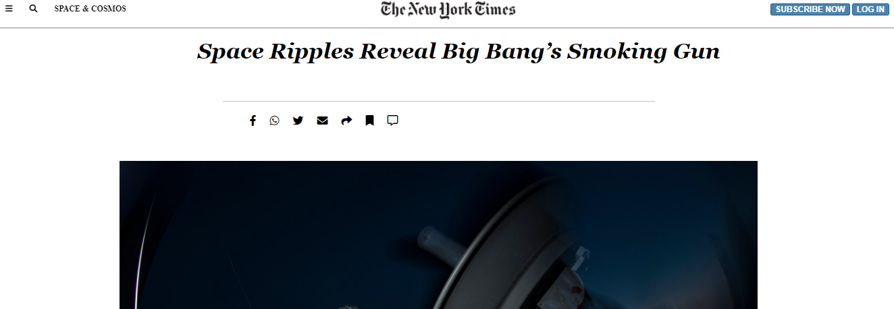

Positioning and floating elements project.

This Project is a clone of the New York Times article page 

## Built With
- HTML
- CSS
- Coffee

## Live Demo
[Live Demo Link]( https://aliabbani.github.io/the-new-york-times-article/)

# Authors

- GitHub: @aliabbani (https://github.com/aliabbani)
- Twitter: @aliabbani
- LinkedIn: @ali abbani (https://www.linkedin.com/in/ali-abbani-8b6246150/)

## 🤝 Contributing

Contributions, issues, and feature requests are welcome!

Feel free to check the [issues page](issues/).

## Show your support

Give a ⭐️ if you like this project!

## Acknowledgments

- Hat tip to anyone whose code was used
- Inspiration
- etc

## 📝 License

This project is [MIT](lic.url) licensed.
=======
# Project Sneak Peaks
